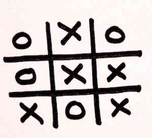

## Tic Tac Toe Analyzer

The goal of this assignment is to develop an application which takes a tic tac toe board, and outputs who the winner is (if any), or whether it is a draw. All of the code in your solution should be originally written by you. Please return your completed assignment within 24 hours from time of receipt.

### Problem

You have just taken over a project that was rushed out the door by the previous developer. It seems to behave correctly with a 3x3 board. Thankfully, it seems like the developer has left behind a test suite to cover what they had already developed.

### Your Goals

- Refactor the existing code to prepare it to work with a n x n board
- Currently the output is "draw", when there is no winner, and the game hasn't finished yet. Change this to say "unfinished" if the game hasn't been finished.

### Running tests

    ./bin/rspec

### Notes

- The tests that run against a 5x5 board are in the test file, but commented out. Uncomment once done to see whether they are passing. Once you are confident in your solution, add tests for 7x7 and 9x9 boards as well.
